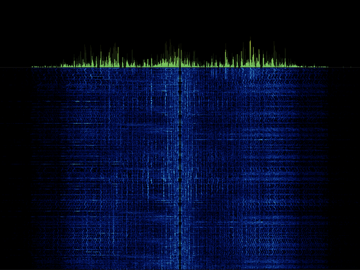

# Spectrogram

Visualisation hack for OpenBSD (sndio) and Linux (alsa) playback.

## OpenBSD

`sndiod` must be started in monitoring mode: `sndiod -m play,mon,midi`

## Linux

Build packages: `sudo apt install libfftw3-dev libasound2-dev libx11-dev`

Audo loopback device: `sudo modprobe snd-aloop`
